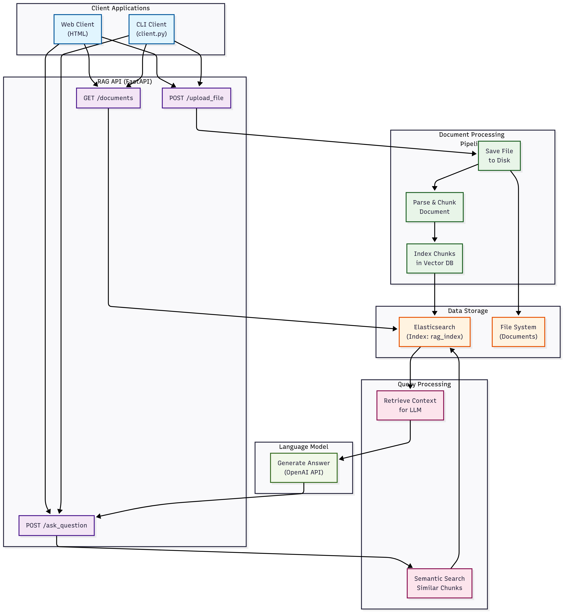
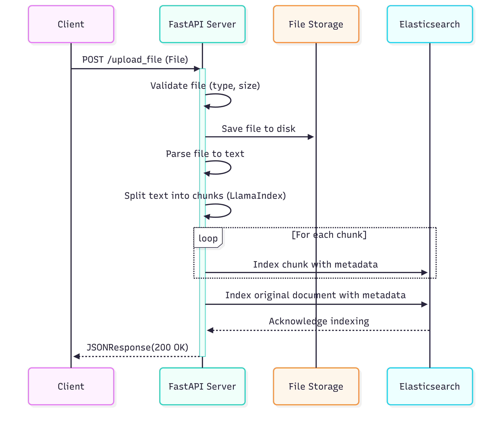
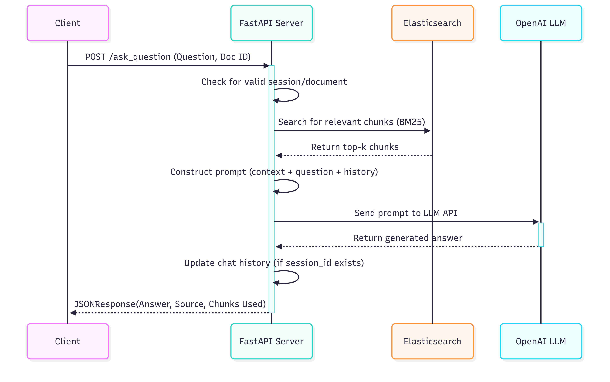
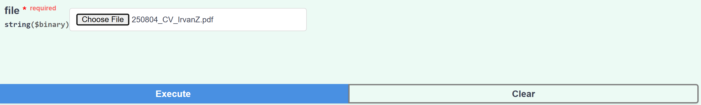
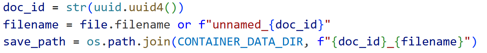
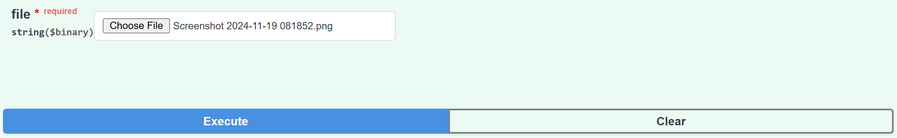
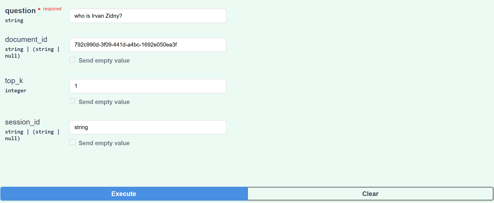

# About me!

I am a data scientist at PT. BANK DKI with two years of experience. I specialize in leveraging data-driven solutions to improve business performance. My work includes using TSFRESH and ML2 modules to forecast key business metrics, conducting RFM analysis and clustering techniques to understand customer behavior, and developing a Streamlit application on Cloudera Machine Learning to predict future customer purchases. The insights I provide help optimize business strategies and decision-making.

---

# A-Doc Assistant!

This API provides a backend for a Retrieval-Augmented Generation (RAG) system, allowing you to upload documents, search their content, and ask questions using an LLM (Large Language Model) powered by the retrieved information.

---
## 🗺️ Solution Design

This Retrieval-Augmented Generation (RAG) system enables users to upload documents and ask questions based on their content. The architecture is designed for modularity, scalability, and efficient integration of traditional search with modern AI capabilities. The system is composed of three primary layers: the client interface, the backend API service, and external services.



Users interact with the system through a web-based client interface. From here, they can upload documents or submit queries using two key API endpoints: /upload_file and /ask_question. These requests are handled by a backend service built using FastAPI, which acts as the central coordinator for processing data and managing workflows.

When a document is uploaded, the backend’s File Handler component saves the file and routes it to the Document Processor. This processor is responsible for extracting text content from various file formats (such as PDF, DOCX, or TXT), splitting the extracted text into manageable chunks, and preparing this content for indexing. The text chunks are then stored in an Elasticsearch cluster, enabling fast, scalable search capabilities. Simultaneously, the original file is saved in persistent storage for future reference or reprocessing.



When a user submits a question, the backend triggers the Retrieval Logic module. This module queries Elasticsearch to retrieve the most relevant document chunks based on the question context. These chunks are used to construct a prompt, which is then passed to an integrated language model (LLM), such as OpenAI’s GPT. The LLM processes the prompt, generates a contextual answer, and returns the result to the user through the API.

This architecture ensures that document uploads are efficiently parsed and stored, while questions are answered accurately by leveraging both indexed knowledge and AI reasoning. The use of Elasticsearch allows for high-performance retrieval, and the integration with an LLM enables natural language understanding and response generation.



---

## 🚀 Getting Started

The server initializes two core services on startup:
* **Elasticsearch**: Used as a fast, scalable search index for storing and retrieving document content. The API waits for Elasticsearch to be available before starting.
* **OpenAI LLM**: The `OpenAI` model is used for generating answers based on retrieved context. This requires the `OPENAI_API_KEY` environment variable to be set.

---

## 🐳 Step-by-Step: Running with Docker

1. Extract the ZIP File
   
```bash
unzip rag_projects.zip
cd rag_projects
```

2. Build Docker Images

```bash
docker-compose up --build
```

3. Start the Application

```bash
docker-compose up
```

4. Access the Application

* API Documentation (Swagger UI): http://localhost:8000/docs
* Elasticsearch (for debugging): http://localhost:9200
* UI WEB: index.html
* client.py

5. Stop the Application

```bash
docker-compose down
```

---

## 🗂️ How to Run client.py or Index.html

### Interact with Client.py

Once your containers are running, you can interact with the server using the client script.
Available Modes:
1. `chat`: Start a chat session with the RAG server.
2. `upload`: Upload documents.
3. `admin`: List and delete uploaded documents.

* Upload a Document:
```bash
docker compose exec rag-api python client.py upload /app/data/sample.pdf
```
1. `sample.pdf` is your document inside the container.
2. Uploading makes it available for grounding chat queries.
Result: Server stores the file and returns a document ID.

* List a Document:
```bash
docker compose exec rag-api python client.py admin
```

1. Lists document IDs and names.
2. Optionally allows deletion of any document.

* Start a Chat Session:
```bash
docker compose exec rag-api python client.py chat -d <document_id>
```

1. Replace <document_id> with ID from admin listing.
2. If no ID is given, the chat will be general (not grounded to any document).

### Interact with Index.html

1. Open Index.html
2. Click `+`, upload sample.pdf.
3. Wait for Upload successful message.
4. Type question: “What is this document about?”
5. Click Send or Enter.
6. View RAG model’s answer below chat box.

---

## 📋 Testing & Validation API Endpoints

### Health Check

`GET /health`

This `GET /health` endpoint provides a detailed health status of the server and its dependencies. It's useful for monitoring the system's operational status.

**Example Response:**
```json
{
  "status": "healthy",
  "message": "RAG Document Server is running",
  "services": {
    "elasticsearch": {
      "available": true,
      "host": "http://elasticsearch:9200",
      "error": null,
      "index": "rag_docs"
    },
    "llm": {
      "available": true,
      "model": "gpt-3.5-turbo"
    }
  },
  "supported_file_types": {
    ".txt": "Plain text files",
    ".pdf": "PDF documents",
    ".docx": "Microsoft Word documents (new format)",
    ".doc": "Microsoft Word documents (legacy format)",
    ".pptx": "Microsoft PowerPoint presentations (new format)",
    ".ppt": "Microsoft PowerPoint presentations (legacy format)",
    ".json": "JSON files",
    ".py": "Python source code files"
  },
  "max_file_size_mb": 10
}
```

### Recreate Index

`POST /admin/recreate_index`

This `POST /admin/recreate_index` endpoint API acts as a `factory reset` for the document knowledge base. It deletes all existing documents and recreates a fresh Elasticsearch index, which is essential for testing, debugging, and maintenance.

**Example Response:**
```json
{"message": "Index recreated successfully"}
```

### Upload File

`POST /upload_file`

This `POST /upload_file` endpoint handles the upload and processing of documents. It validates the file, extracts and chunks its text content, and indexes the data into Elasticsearch for future retrieval and querying. Upon success, it returns a unique document ID and other metadata.

**Example Response with Supported Extension:**

```json
{
  "document_id": "792c990d-3f09-441d-a4bc-1692e050ea3f",
  "filename": "250804_CV_IrvanZ.pdf",
  "file_type": "PDF documents",
  "file_extension": ".pdf",
  "file_size_bytes": 132676,
  "text_length": 7230,
  "chunks_created": 4,
  "parse_method": ".pdf_parser",
  "message": "Document uploaded and indexed successfully using .pdf parser"
}
```

Upon successful validation, the backend generates a unique identifier for the document using Python’s `uuid` module, specifically `str(uuid.uuid4())`. This guarantees that every document receives a distinct document_id, avoiding conflicts and enabling precise tracking and retrieval. 



**Example Response with Unsupported Extension:**

```json
{
  "detail": "Unsupported file type '.png'. Supported: .doc, .docx, .json, .pdf, .ppt, .pptx, .py, .txt"
}
```


### Ask Question

`POST /ask_question`

This `POST /ask_question` endpoint allows you to query the RAG system. It retrieves the most relevant document chunks based on the question, uses a Language Model to formulate a comprehensive answer from that context, and can also maintain conversation history.

**Example**


**Responses**
```json
{
  "answer": "Irvan Zidny is a data scientist with two years of experience at PT. BANK DKI in Jakarta, Indonesia.",
  "source": "document_context",
  "document_id": "792c990d-3f09-441d-a4bc-1692e050ea3f",
  "chunks_used": 1,
  "session_id": "string"
}
```

### List Document

`GET /documents`

This `GET /documents` endpoint retrieves and returns a list of uploaded documents stored in Elasticsearch, including metadata like filename, size, and creation date. It sorts documents by creation time (or ID if unavailable) and handles errors gracefully, ensuring the frontend can display recent documents reliably.

**Example Response:**
```json
{
  "documents": [
    {
      "document_id": "792c990d-3f09-441d-a4bc-1692e050ea3f",
      "filename": "250804_CV_IrvanZ.pdf",
      "file_extension": ".pdf",
      "file_size_bytes": 132676,
      "parse_method": ".pdf_parser",
      "created_at": "2025-08-04T07:46:27.085293",
      "text_length": 7230
    }
  ]
}
```

### List Document

`GET /documents`

This `GET /documents` endpoint retrieves and returns a list of uploaded documents stored in Elasticsearch, including metadata like filename, size, and creation date. It sorts documents by creation time (or ID if unavailable) and handles errors gracefully, ensuring the frontend can display recent documents reliably.

**Example Response:**
```json
{
  "documents": [
    {
      "document_id": "792c990d-3f09-441d-a4bc-1692e050ea3f",
      "filename": "250804_CV_IrvanZ.pdf",
      "file_extension": ".pdf",
      "file_size_bytes": 132676,
      "parse_method": ".pdf_parser",
      "created_at": "2025-08-04T07:46:27.085293",
      "text_length": 7230
    }
  ]
}
```

### Metadata Document

`GET /document/{document_id}`

This `GET /document/{document_id}` endpoint retrieves detailed information about a specific document stored in Elasticsearch, including metadata, text length, and a text preview. It also counts how many chunks the document was split into for processing. If the document isn’t found, it returns a 404 error; otherwise, it responds with structured metadata and chunk statistics.

**Example Response:**
```json
{
  "document_id": "792c990d-3f09-441d-a4bc-1692e050ea3f",
  "filename": "250804_CV_IrvanZ.pdf",
  "file_extension": ".pdf",
  "file_size_bytes": 132676,
  "parse_method": ".pdf_parser",
  "created_at": "2025-08-04T07:46:27.085293",
  "text_length": 7230,
  "chunk_count": 4,
  "text_preview": "IRVAN ZIDNY\nDATA SCIENTIST\nJakarta, Indonesia • izcd4399@gmail.com • (+62) 813-1231-2595\nSUMMARY\nI am a data scientist at PT. BANK DKI with two years of experience. I specialize in leveraging data-driven solutions to\nimprove business performance. My work includes using TSFRESH and ML2 modules to forecast key business metrics,\nconducting RFM analysis and clustering techniques to understand customer behavior, and developing a Streamlit\napplication on Cloudera Machine Learning to predict future cus..."
}
```

### Delete Document

`DELETE /document/{document_id}`

This `DELETE /document/{document_id}` DELETE endpoint removes a specific document and all its associated chunks from Elasticsearch. It also deletes related files from local storage if they exist. If the document is not found, it returns a 404 error; otherwise, it confirms successful deletion.

**Example Response:**
```json
{
  "message": "Document deleted successfully"
}
```


